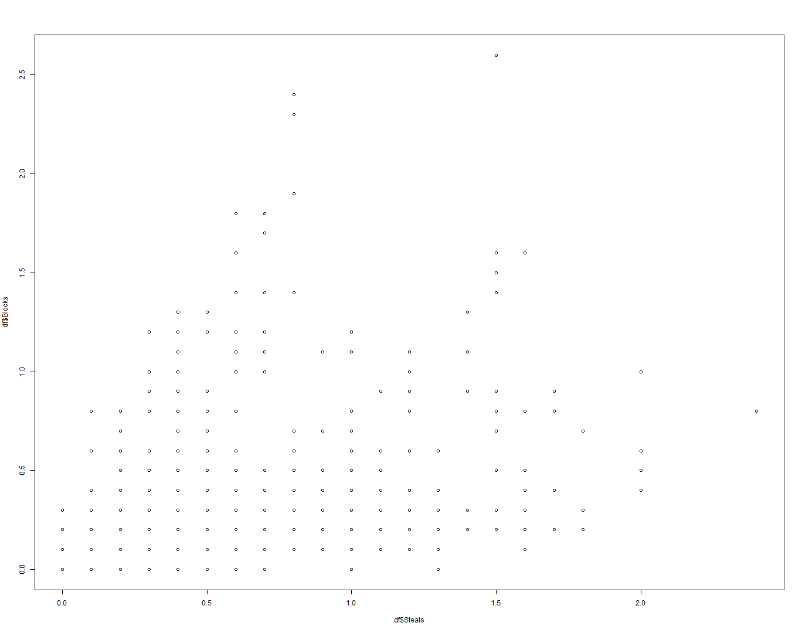

Week 4 Presentation
========================================================
author: Armen Khachatourian
date: 7/21/2018
autosize: true

NBA Stats 2018 Season
========================================================

We will be looking at the following stats

- Position
- Age
- Points per game
- Average FG%
- Average FT%
- Threes per game
- Rebounds per game
- Assists per game
- Steals per game
- Blocks per game
- Turnovers per game

Basic Exploratory Analysis
========================================================


```r
str(df)
```

```
'data.frame':	540 obs. of  12 variables:
 $ Player   : Factor w/ 540 levels "Aaron Brooks",..: 155 37 79 57 189 268 33 205 96 323 ...
 $ Pos      : Factor w/ 5 levels "C","PF","PG",..: 3 5 4 4 3 5 5 4 4 3 ...
 $ Age      : int  28 27 31 22 26 25 23 27 30 27 ...
 $ Points   : num  17.7 14.3 5.3 2.2 8.6 13.9 1.4 9.7 5.7 1.7 ...
 $ FG_perc  : num  0.473 0.414 0.449 0.29 0.38 0.451 0.381 0.404 0.451 0.292 ...
 $ FT_perc  : num  0.792 0.768 0.722 0.833 0.902 0.8 0.667 0.818 0.596 0 ...
 $ Threes   : num  1.7 1.6 0.4 0.3 1.1 1.4 0.2 1.4 0.8 0.3 ...
 $ Rebounds : num  3.8 2.5 2.1 1.8 2.3 2.7 0.8 3.4 4.1 0.3 ...
 $ Assists  : num  5 2 0.9 0.4 3.8 2.7 0.1 1.2 0.7 1 ...
 $ Steals   : num  2 1.1 1.1 0.3 0.8 0.7 0.4 0.8 0.5 0 ...
 $ Blocks   : num  0.6 0.2 0.2 0.3 0.1 0.1 0.3 0.3 0.4 0 ...
 $ Turnovers: num  2.9 2.2 0.7 0.3 1.5 1.6 0.4 0.9 0.5 0.3 ...
```

Slice data in multiple ways using left pane
========================================================
Here's just one example, a scatterplot of Blocks vs Steals


Thank You
========================================================
The program is fairly intuitive, I hope you enjoy it.

You can find it on the link below.

https://aakhacha.shinyapps.io/week_4_project/
